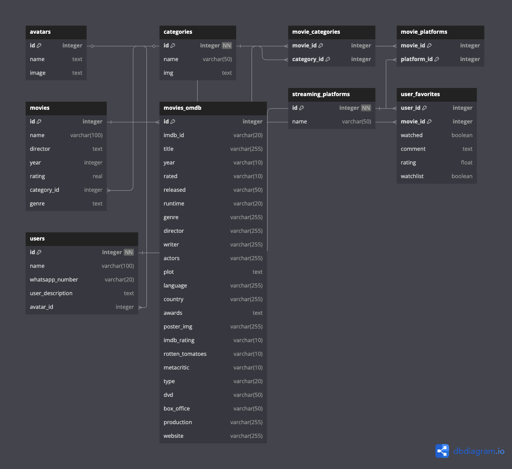

# MoviWeb App 🎬

## Overview
MoviWeb is a dynamic web application that allows users to discover, track, and share their favorite movies. Built with Flask, this platform enables users to create personalized movie lists, share recommendations, and engage with a community of movie enthusiasts.

## Current Development Status
- ✅ Database Schema Design Complete
- ✅ Initial Data Population:
  - 100 movies pre-loaded
  - 10 user avatars prepared
  - Streaming platform icons ready
- 🚧 User Authentication (In Progress)
- 🚧 Web Interface (In Progress)

## Database Schema

### Schema Explanation
The database is designed with the following key components:

1. **Users Table**
   - Stores user information including name and WhatsApp contact
   - Forms the base for user authentication and personalization

2. **Movies Table**
   - Contains movie details (name, year, rating, genre)
   - Connected to categories for better organization

3. **User Favorites**
   - Links users with their favorite movies
   - Includes watched status, personal ratings, and comments

4. **Categories & Movie Categories**
   - Enables movie categorization
   - Supports multiple categories per movie

5. **Streaming Platforms**
   - Tracks where movies are available to watch
   - Connected through movie_platforms junction table

## Planned Features
- User authentication and profiles
- Personalized movie recommendations
- Community reviews and ratings
- Watch status tracking
- Multi-platform availability information
- Category-based movie browsing

## Technical Stack
- Backend: Flask (Python)
- Database: SQLite
- Frontend: HTML, CSS, JavaScript (planned)

## Getting Started
(Coming soon - Will include setup instructions and requirements)

## Contributing
This project is currently in development. Contribution guidelines will be added soon.

## License
TBD 
